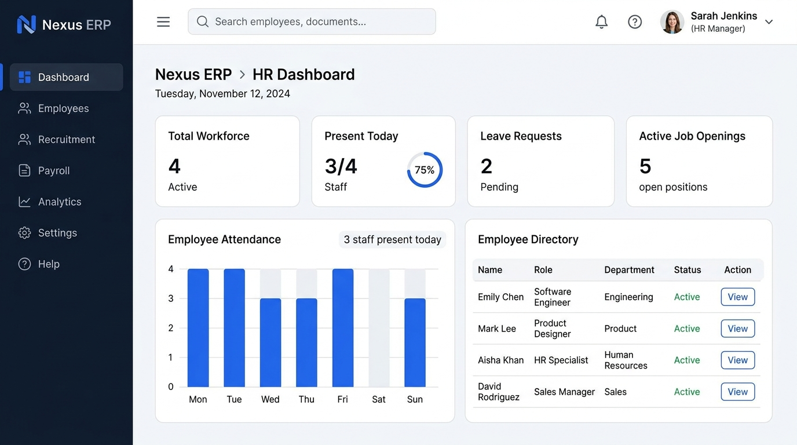

<div align="center">

# Nexus ERP — Company Portal

A modern, enterprise-grade Human Resources & Employee Self-Service portal built with React 19 and Vite. Designed for organizations that need a clean, responsive platform for workforce management, payroll, leave tracking, and operational oversight.



[](https://react.dev/)
[](https://vite.dev/)
[](LICENSE)

</div>

---

## Overview

Nexus ERP is a single-page web application that serves two distinct user roles through a unified interface:

- **Employee Self-Service (ESS) Portal** — Employees manage their own attendance, leave requests, payslips, reimbursements, support tickets, and performance reviews.
- **HR Administration Dashboard** — HR personnel oversee the entire workforce through an executive command center with KPI monitoring, leave approvals, payroll processing, and company-wide announcements.

The application features a clean enterprise design system with dark/light theme support, full mobile responsiveness, and zero external UI library dependencies.

---

## Features

### Employee Self-Service Portal

| Module | Description |
|---|---|
| **Dashboard Overview** | Daily operational summary with shift status, leave balance, pending claims, and quick action shortcuts |
| **Personnel Profile** | View and edit personal details, banking info, tax ID, and pension records |
| **Shift Attendance** | Live clock-in/clock-out timer with elapsed duration tracking and attendance history log |
| **Leave Manager** | Apply for annual, sick, or casual leave with date range selection and entitlement balance cards |
| **Payroll & Payslips** | View monthly payslip statements with gross/tax/net breakdowns and PDF download simulation |
| **Reimbursements** | Submit expense claims with category selection, amount, description, and receipt upload |
| **IT & HR Helpdesk** | Log support tickets with priority levels, category assignment, and status tracking |
| **HMO & Benefits** | Virtual health insurance enrollee card with policy entitlement summary |
| **Performance & OKRs** | Quarterly task completion rate, punctuality score, and manager rating overview |

### HR Administration Dashboard

| Module | Description |
|---|---|
| **Executive Command Center** | Real-time KPI grid (workforce count, attendance rate, pending approvals, payroll total) with department distribution and punctuality trend charts |
| **Employee Roster** | Full directory with department filtering, employee dossier modal, and staff onboarding form |
| **Company Attendance** | Organization-wide shift logs with clock times, overtime hours, and punctuality flags |
| **Leave Approvals** | Queue of pending leave requests with one-click approve/reject actions |
| **Payroll & Claims Admin** | Expense reimbursement review queue and monthly payroll batch processing |
| **Helpdesk Queue** | Assign and resolve open support tickets across IT and HR categories |
| **Announcements** | Broadcast company-wide notices with urgency type classification |
| **Analytics & Reports** | Retention rate, ticket resolution SLA, and leave utilization metrics with audit export |

### Cross-Cutting Features

- **Dark / Light Theme** — Persisted to `localStorage`, toggled from within the sidebar navigation
- **Mobile-First Responsive Design** — Sidebar converts to a slide-out drawer with backdrop overlay on screens ≤ 900px
- **Role-Based Views** — Login screen with quick persona switching between Employee and HR Admin
- **Toast Notifications** — Non-blocking feedback for all user actions (leave submitted, ticket logged, etc.)
- **Floating Role Switcher** — Quickly toggle between ESS and HR dashboards without logging out

---

## Tech Stack

| Layer | Technology |
|---|---|
| **Framework** | [React 19](https://react.dev/) with functional components and hooks |
| **Build Tool** | [Vite 8](https://vite.dev/) with HMR and optimized production builds |
| **Styling** | Vanilla CSS with CSS custom properties (design tokens) for theming |
| **Typography** | [Plus Jakarta Sans](https://fonts.google.com/specimen/Plus+Jakarta+Sans) via Google Fonts |
| **Linting** | ESLint 10 with `eslint-plugin-react-hooks` and `eslint-plugin-react-refresh` |
| **State Management** | React `useState` / `useEffect` — no external state library required |

> **Zero external UI dependencies.** All components, modals, tables, badges, buttons, and layout primitives are built from scratch with vanilla CSS.

---

## Getting Started

### Prerequisites

- [Node.js](https://nodejs.org/) v18 or later
- npm v9+ (ships with Node.js)

### Installation

```bash
# Clone the repository
git clone https://github.com/your-username/nexus-erp.git
cd nexus-erp

# Install dependencies
npm install

# Start the development server
npm run dev
```

The app will be available at `http://localhost:5173` by default.

### Build for Production

```bash
npm run build
```

The optimized output is written to the `dist/` directory and can be served by any static file host.

### Preview Production Build

```bash
npm run preview
```

### Lint

```bash
npm run lint
```

---

## Project Structure

```
nexus-erp/
├── public/                     # Static assets
├── src/
│   ├── assets/                 # Images and media
│   ├── components/
│   │   ├── Login.jsx           # Split-screen authentication view
│   │   ├── ESSDashboard.jsx    # Employee Self-Service portal (9 modules)
│   │   └── HRDashboard.jsx     # HR Administration dashboard (8 modules)
│   ├── styles/                 # Additional stylesheets
│   ├── App.jsx                 # Root component — routing, shared state, theme, toasts
│   ├── App.css                 # Login layout, toast styles, persona switcher
│   ├── index.css               # Design system — tokens, components, responsive breakpoints
│   └── main.jsx                # React DOM entry point
├── index.html                  # HTML shell
├── vite.config.js              # Vite configuration
├── eslint.config.js            # ESLint flat config
└── package.json
```

---

## Design System

The application uses a CSS custom property–based design system defined in `src/index.css`.

### Color Tokens

| Token | Light | Dark | Usage |
|---|---|---|---|
| `--primary` | `#2563eb` | `#3b82f6` | Interactive elements, active states |
| `--bg-app` | `#f8fafc` | `#0b0f19` | Page background |
| `--surface-card` | `#ffffff` | `#161e2e` | Card and panel surfaces |
| `--bg-sidebar` | `#0f172a` | `#0f172a` | Sidebar background |
| `--success` | `#16a34a` | `#22c55e` | Approved, on-time, positive states |
| `--warning` | `#d97706` | `#f59e0b` | Pending, attention-required states |
| `--danger` | `#dc2626` | `#ef4444` | Rejected, late, destructive actions |

### Responsive Breakpoints

| Breakpoint | Behavior |
|---|---|
| `> 1024px` | Full desktop layout with persistent sidebar |
| `≤ 1024px` | Stats grid collapses to 2 columns |
| `≤ 900px` | Sidebar becomes a slide-out drawer with backdrop overlay |
| `≤ 640px` | Single-column layout, compact buttons and typography |

---

## Demo Credentials

The login screen includes **Quick Access** buttons for instant role switching:

| Role | Button | Access |
|---|---|---|
| Employee | `Employee Portal` | ESS Dashboard with all 9 self-service modules |
| HR Admin | `HR Admin` | Administrative dashboard with workforce management tools |

No backend authentication is required — the app runs entirely on the client with simulated demo data.

---

## Roadmap

- [ ] Backend API integration (Node.js / Express or Django REST)
- [ ] Database persistence (PostgreSQL / MongoDB)
- [ ] JWT authentication with role-based access control
- [ ] File upload for receipts and documents (S3 / Cloud Storage)
- [ ] Email notification triggers for leave approvals
- [ ] Real-time WebSocket updates for helpdesk tickets
- [ ] PDF payslip generation and download
- [ ] Advanced analytics with interactive charts (Chart.js / Recharts)
- [ ] Multi-tenant organization support
- [ ] Internationalisation (i18n) and localisation

---

## Contributing

Contributions are welcome. Please follow these steps:

1. **Fork** the repository
2. **Create** a feature branch (`git checkout -b feature/your-feature-name`)
3. **Commit** your changes with clear, descriptive messages
4. **Push** to your fork (`git push origin feature/your-feature-name`)
5. **Open** a Pull Request against `main`

Please ensure all code passes `npm run lint` and `npm run build` before submitting.

---

## License

This project is licensed under the [MIT License](LICENSE).

---

<div align="center">
  <sub>Built with React 19 + Vite 8 — Designed for modern enterprise teams.</sub>
</div>
